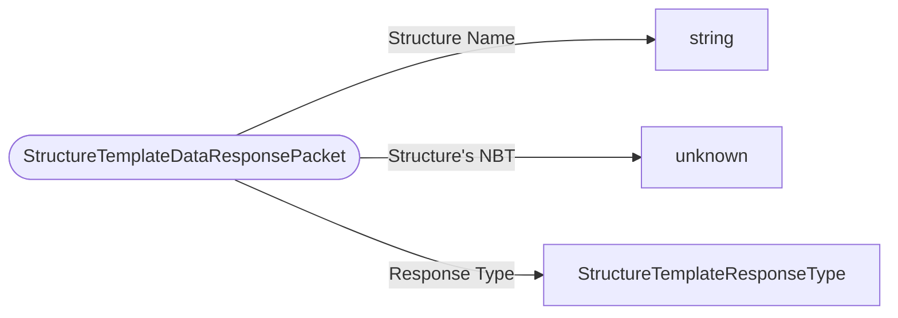

# StructureTemplateDataResponsePacket

`packet` - id **133**

- protocol: 2168
- minecraft: 1.26.40

The client sends a packet to the server, from there the structure is built and then put into a Tag where it is sent back to the client, from there you can view the structure in the Structure Block Screen. Currently this functionality is completely disabled and does nothing. Used to reply to a request for structure information.

