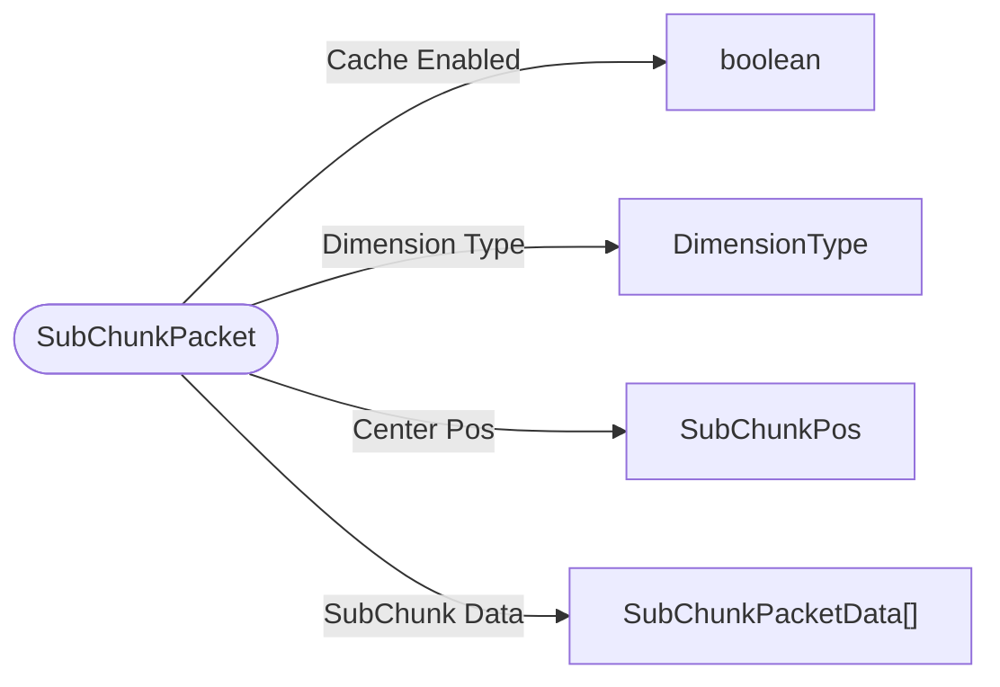

# SubChunkPacket

`packet` - id **174**

- protocol: 2168
- minecraft: 1.26.40

Contains subchunk terrain data, heightmaps, and optional blob cache IDs.

```mermaid
flowchart LR
  ROOT(["SubChunkPacket"])
  ROOT -->|"Cache Enabled"| boolean["boolean"]
  ROOT -->|"Dimension Type"| DimensionType["DimensionType"]
  ROOT -->|"Center Pos"| SubChunkPos["SubChunkPos"]
  ROOT -->|"SubChunk Data"| SubChunkPacketData["SubChunkPacketData[]"]
```

