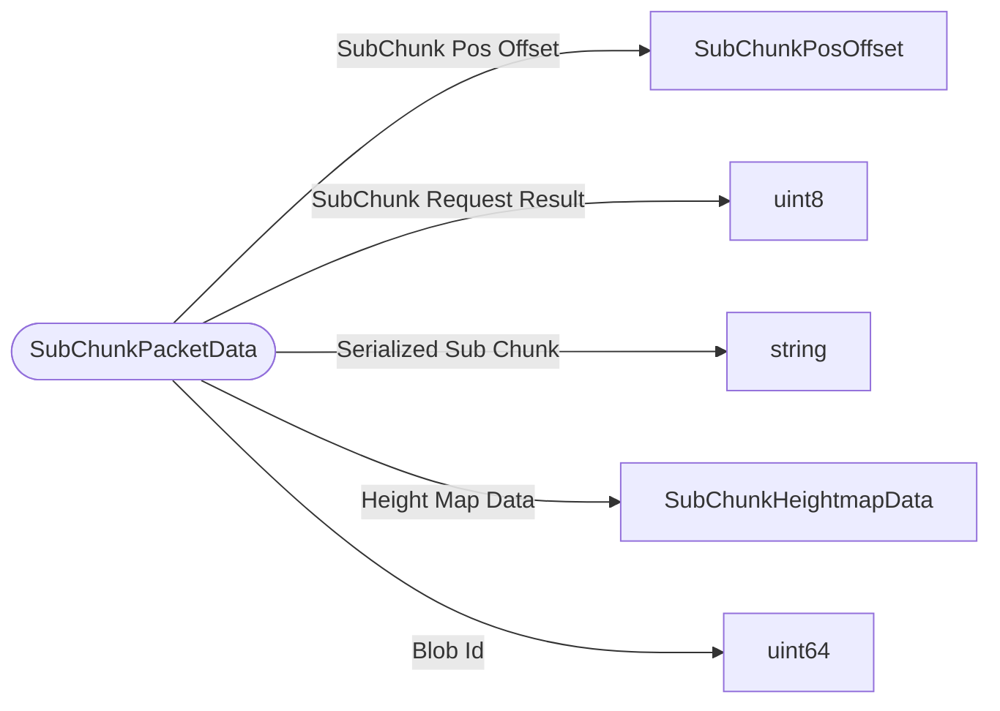

# SubChunkPacketData

`packet`

```mermaid
flowchart LR
  ROOT(["SubChunkPacketData"])
  ROOT -->|"SubChunk Pos Offset"| SubChunkPosOffset["SubChunkPosOffset"]
  ROOT -->|"SubChunk Request Result"| uint8["uint8"]
  ROOT -->|"Serialized Sub Chunk"| string["string"]
  ROOT -->|"Height Map Data"| SubChunkHeightmapData["SubChunkHeightmapData"]
  ROOT -->|"Blob Id"| uint64["uint64"]
```

