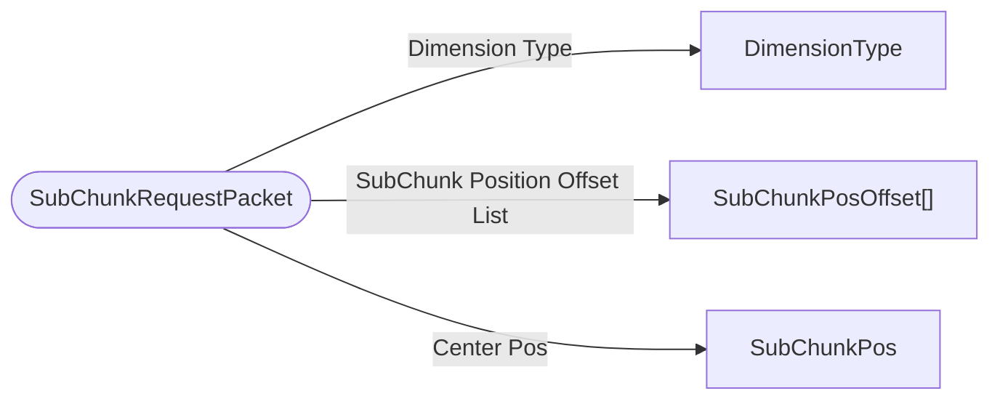

# SubChunkRequestPacket

`packet` - id **175**

- protocol: 2168
- minecraft: 1.26.40

```mermaid
flowchart LR
  ROOT(["SubChunkRequestPacket"])
  ROOT -->|"Dimension Type"| DimensionType["DimensionType"]
  ROOT -->|"SubChunk Position Offset List"| SubChunkPosOffset["SubChunkPosOffset[]"]
  ROOT -->|"Center Pos"| SubChunkPos["SubChunkPos"]
```

