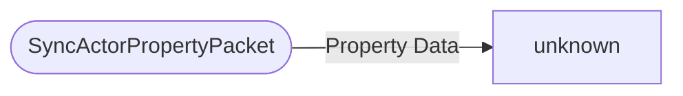

# SyncActorPropertyPacket

`packet` - id **165**

- protocol: 2168
- minecraft: 1.26.40

Intended to one day replace SynchedActorData.

```mermaid
flowchart LR
  ROOT(["SyncActorPropertyPacket"])
  ROOT -->|"Property Data"| unknown["unknown"]
```

