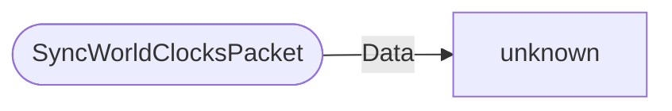

# SyncWorldClocksPacket

`packet` - id **344**

- protocol: 2168
- minecraft: 1.26.40

	Sent from the server when a client joins to initialize all world clocks for the client and periodically to all clients to keep them in sync.
	It is also sent to all clients when a world clock's paused state changes or when time markers are added or removed.
	

