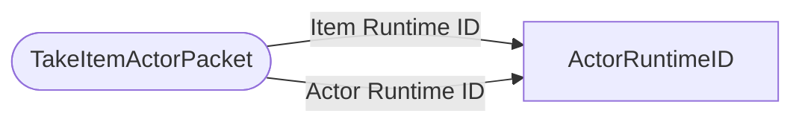

# TakeItemActorPacket

`packet` - id **17**

From this the item and count is turned into an item and the transaction is handled afterwards.

```mermaid
flowchart LR
  ROOT(["TakeItemActorPacket"])
  ROOT -->|"Item Runtime ID"| ActorRuntimeID["ActorRuntimeID"]
  ROOT -->|"Actor Runtime ID"| ActorRuntimeID["ActorRuntimeID"]
```

