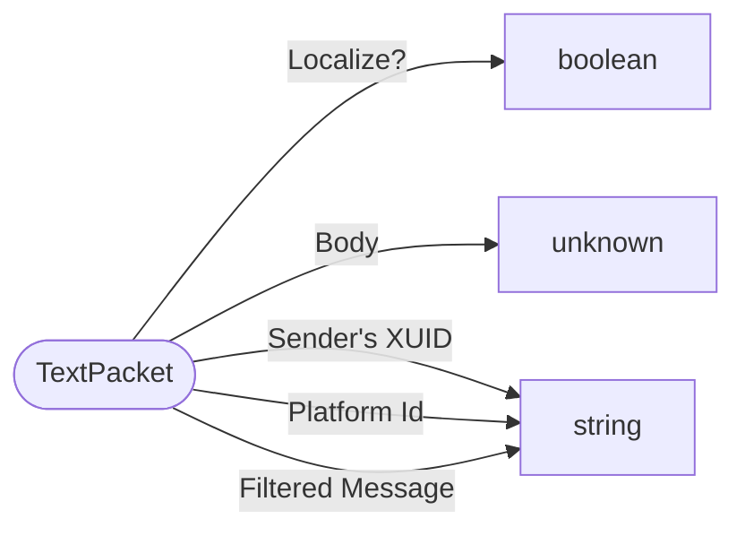

# TextPacket

`packet` - id **9**

Used for commands, messages, and other info printed to the screen. Most of which are server->client or server broadcasted to all clients, but some cases have a client to other client via the server

