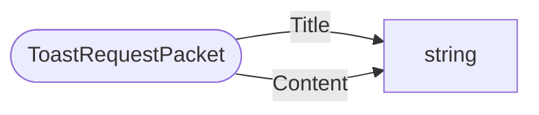

# ToastRequestPacket

`packet` - id **186**

- protocol: 2168
- minecraft: 1.26.40

```mermaid
flowchart LR
  ROOT(["ToastRequestPacket"])
  ROOT -->|"Title"| string["string"]
  ROOT -->|"Content"| string["string"]
```

