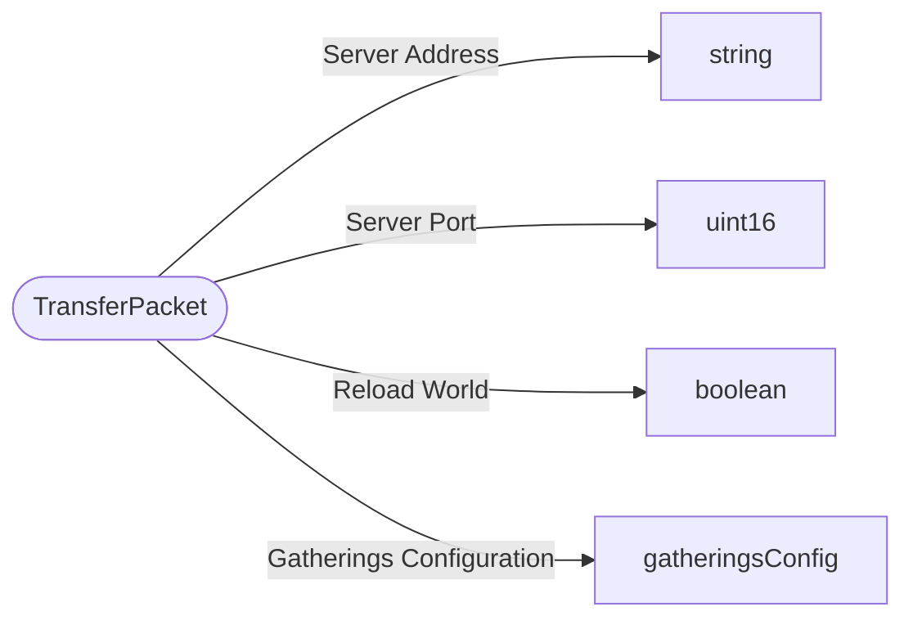

# TransferPacket

`packet` - id **85**

- protocol: 2168
- minecraft: 1.26.40

```mermaid
flowchart LR
  ROOT(["TransferPacket"])
  ROOT -->|"Server Address"| string["string"]
  ROOT -->|"Server Port"| uint16["uint16"]
  ROOT -->|"Reload World"| boolean["boolean"]
  ROOT -->|"Gatherings Configuration"| gatheringsConfig["gatheringsConfig"]
```

