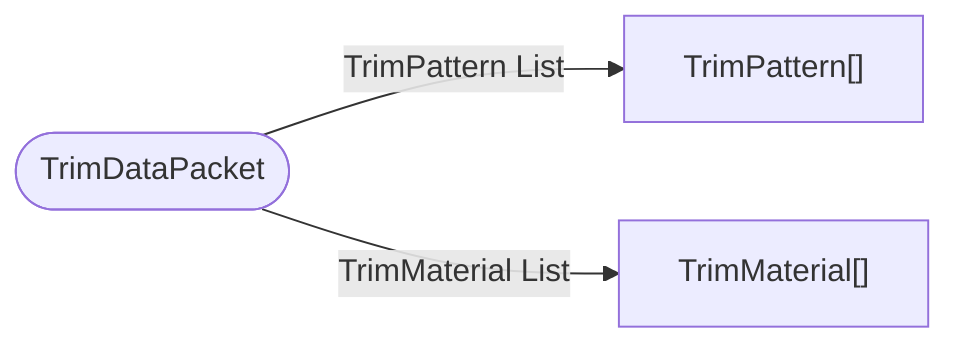

# TrimDataPacket

`packet` - id **302**

- protocol: 2168
- minecraft: 1.26.40

- mTrimPatterns: vector of TrimPattern
- mTrimMaterials: vector of TrimMaterial

```mermaid
flowchart LR
  ROOT(["TrimDataPacket"])
  ROOT -->|"TrimPattern List"| TrimPattern["TrimPattern[]"]
  ROOT -->|"TrimMaterial List"| TrimMaterial["TrimMaterial[]"]
```

