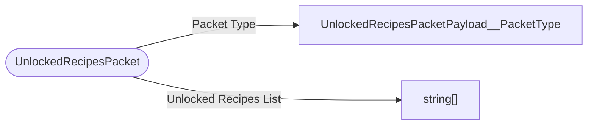

# UnlockedRecipesPacket

`packet` - id **199**

```mermaid
flowchart LR
  ROOT(["UnlockedRecipesPacket"])
  ROOT -->|"Packet Type"| UnlockedRecipesPacketPayload__PacketType["UnlockedRecipesPacketPayload__PacketType"]
  ROOT -->|"Unlocked Recipes List"| string["string[]"]
```

