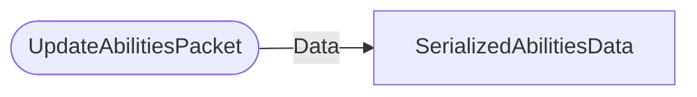

# UpdateAbilitiesPacket

`packet` - id **187**

- protocol: 2168
- minecraft: 1.26.40

```mermaid
flowchart LR
  ROOT(["UpdateAbilitiesPacket"])
  ROOT -->|"Data"| SerializedAbilitiesData["SerializedAbilitiesData"]
```

