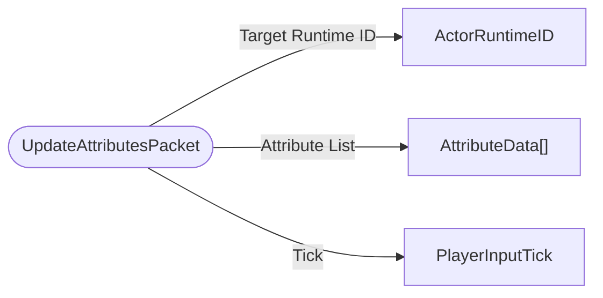

# UpdateAttributesPacket

`packet` - id **29**

Occasionally updating player attributes (buffs/debuffs, health, etc)

```mermaid
flowchart LR
  ROOT(["UpdateAttributesPacket"])
  ROOT -->|"Target Runtime ID"| ActorRuntimeID["ActorRuntimeID"]
  ROOT -->|"Attribute List"| AttributeData["AttributeData[]"]
  ROOT -->|"Tick"| PlayerInputTick["PlayerInputTick"]
```

