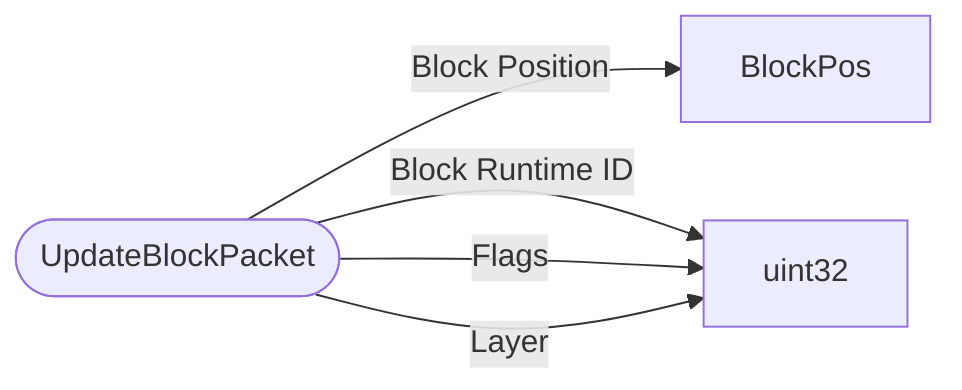

# UpdateBlockPacket

`packet` - id **21**

- protocol: 2168
- minecraft: 1.26.40

This happens often. Luckily, the packets are small.

```mermaid
flowchart LR
  ROOT(["UpdateBlockPacket"])
  ROOT -->|"Block Position"| BlockPos["BlockPos"]
  ROOT -->|"Block Runtime ID"| uint32["uint32"]
  ROOT -->|"Flags"| uint32["uint32"]
  ROOT -->|"Layer"| uint32["uint32"]
```

