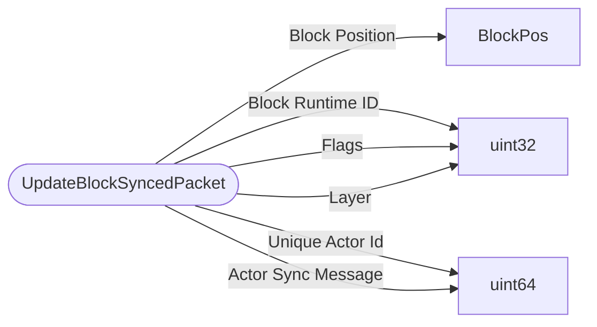

# UpdateBlockSyncedPacket

`packet` - id **110**

Variation of UpdateBlockSyncedPacket that includes information to sync entities with renderchunk generation. Occasionally when blocks change a sync message is sent and during the change on the dimension, this packet is sent to the client to alert the update flags and sync info at a specific position.

