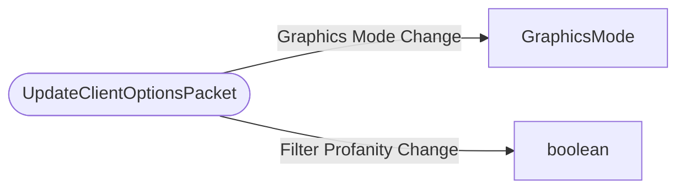

# UpdateClientOptionsPacket

`packet` - id **323**

The values in this packet are originally synced through the Connection Request and then updated via this packet.

```mermaid
flowchart LR
  ROOT(["UpdateClientOptionsPacket"])
  ROOT -->|"Graphics Mode Change"| GraphicsMode["GraphicsMode"]
  ROOT -->|"Filter Profanity Change"| boolean["boolean"]
```

