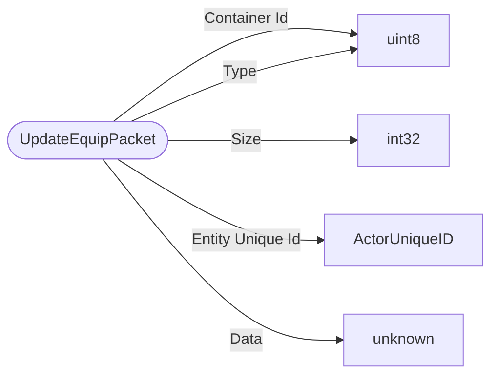

# UpdateEquipPacket

`packet` - id **81**

```mermaid
flowchart LR
  ROOT(["UpdateEquipPacket"])
  ROOT -->|"Container Id"| uint8["uint8"]
  ROOT -->|"Type"| uint8["uint8"]
  ROOT -->|"Size"| int32["int32"]
  ROOT -->|"Entity Unique Id"| ActorUniqueID["ActorUniqueID"]
  ROOT -->|"Data"| unknown["unknown"]
```

