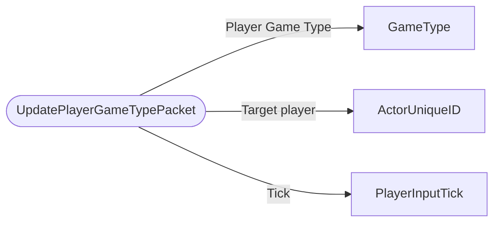

# UpdatePlayerGameTypePacket

`packet` - id **151**

```mermaid
flowchart LR
  ROOT(["UpdatePlayerGameTypePacket"])
  ROOT -->|"Player Game Type"| GameType["GameType"]
  ROOT -->|"Target player"| ActorUniqueID["ActorUniqueID"]
  ROOT -->|"Tick"| PlayerInputTick["PlayerInputTick"]
```

