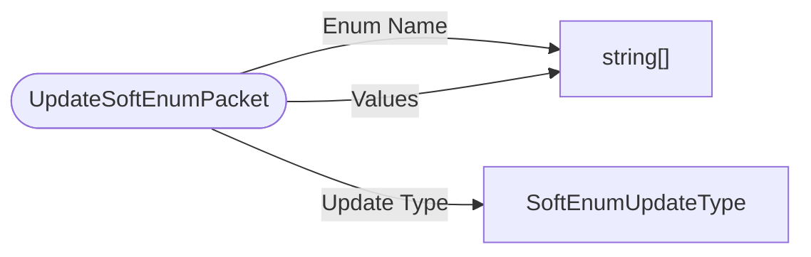

# UpdateSoftEnumPacket

`packet` - id **114**

This allows someone to sync between server and client tags and enums on mobs or on the level.

```mermaid
flowchart LR
  ROOT(["UpdateSoftEnumPacket"])
  ROOT -->|"Enum Name"| string["string"]
  ROOT -->|"Values"| string["string[]"]
  ROOT -->|"Update Type"| SoftEnumUpdateType["SoftEnumUpdateType"]
```

