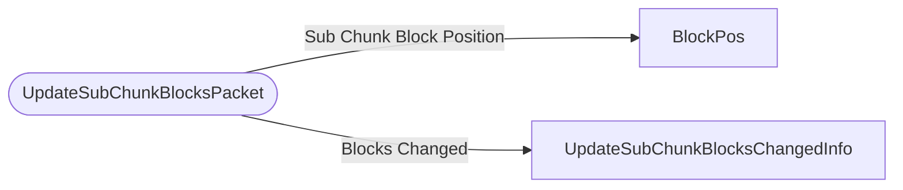

# UpdateSubChunkBlocksPacket

`packet` - id **172**

- protocol: 2168
- minecraft: 1.26.40

```mermaid
flowchart LR
  ROOT(["UpdateSubChunkBlocksPacket"])
  ROOT -->|"Sub Chunk Block Position"| BlockPos["BlockPos"]
  ROOT -->|"Blocks Changed"| UpdateSubChunkBlocksChangedInfo["UpdateSubChunkBlocksChangedInfo"]
```

