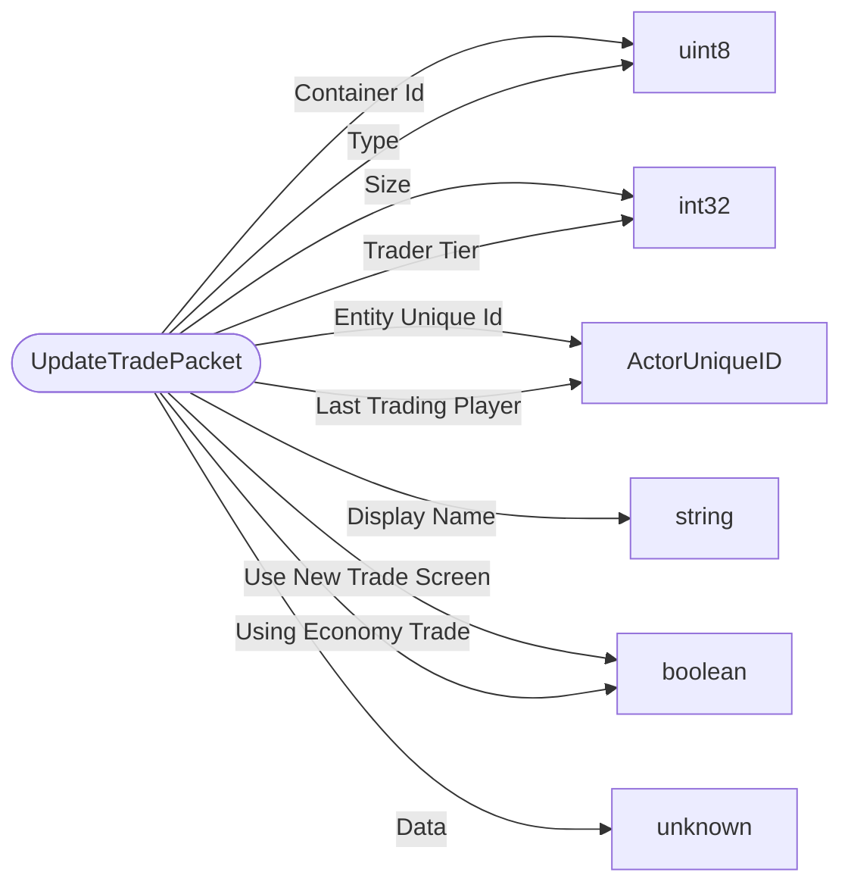

# UpdateTradePacket

`packet` - id **80**

```mermaid
flowchart LR
  ROOT(["UpdateTradePacket"])
  ROOT -->|"Container Id"| uint8["uint8"]
  ROOT -->|"Type"| uint8["uint8"]
  ROOT -->|"Size"| int32["int32"]
  ROOT -->|"Trader Tier"| int32["int32"]
  ROOT -->|"Entity Unique Id"| ActorUniqueID["ActorUniqueID"]
  ROOT -->|"Last Trading Player"| ActorUniqueID["ActorUniqueID"]
  ROOT -->|"Display Name"| string["string"]
  ROOT -->|"Use New Trade Screen"| boolean["boolean"]
  ROOT -->|"Using Economy Trade"| boolean["boolean"]
  ROOT -->|"Data"| unknown["unknown"]
```

