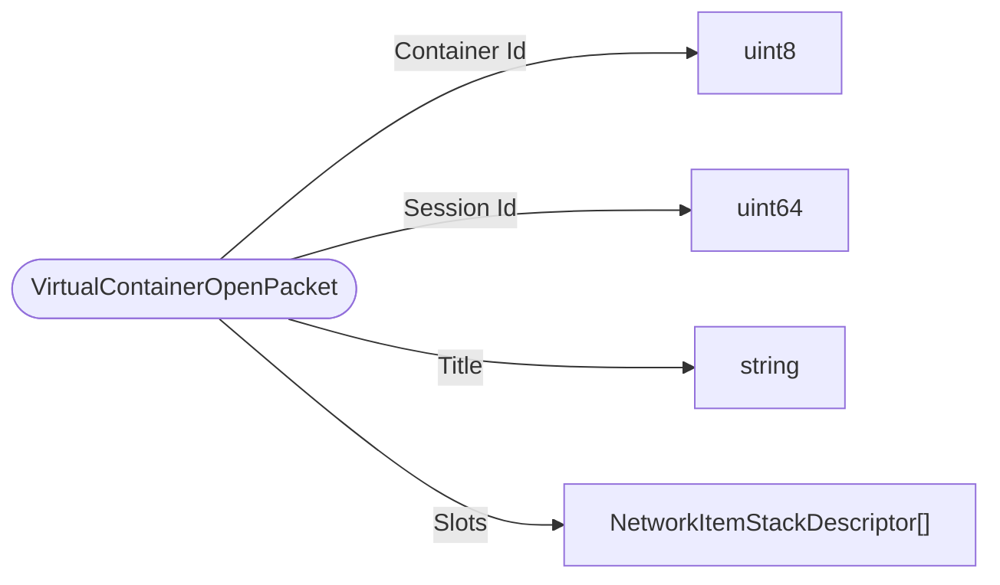

# VirtualContainerOpenPacket

`packet` - id **366**

Includes all initial slots and their server net IDs. The number of slots determines the container size.

```mermaid
flowchart LR
  ROOT(["VirtualContainerOpenPacket"])
  ROOT -->|"Container Id"| uint8["uint8"]
  ROOT -->|"Session Id"| uint64["uint64"]
  ROOT -->|"Title"| string["string"]
  ROOT -->|"Slots"| NetworkItemStackDescriptor["NetworkItemStackDescriptor[]"]
```

