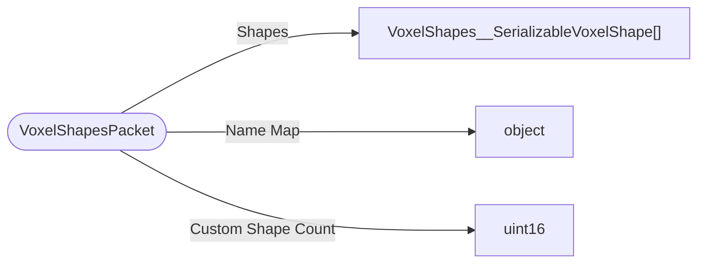

# VoxelShapesPacket

`packet` - id **337**

Sends the serializable voxel shapes data to the client as it's needed on both the client and server. This packet should always be sent before StartGamePacket.

