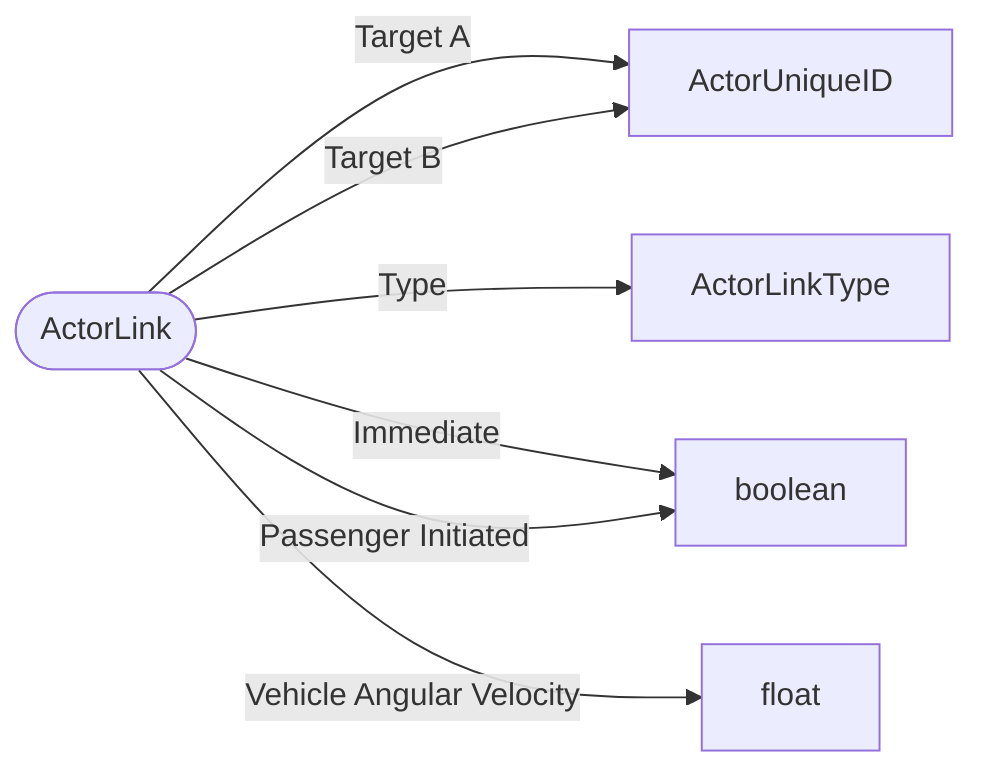

# ActorLink

`struct`

```mermaid
flowchart LR
  ROOT(["ActorLink"])
  ROOT -->|"Target A"| ActorUniqueID["ActorUniqueID"]
  ROOT -->|"Target B"| ActorUniqueID["ActorUniqueID"]
  ROOT -->|"Type"| ActorLinkType["ActorLinkType"]
  ROOT -->|"Immediate"| boolean["boolean"]
  ROOT -->|"Passenger Initiated"| boolean["boolean"]
  ROOT -->|"Vehicle Angular Velocity"| float["float"]
```

