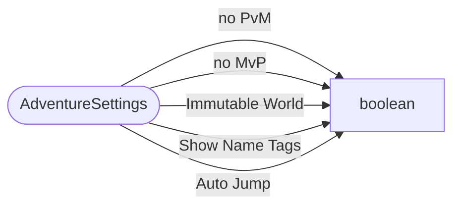

# AdventureSettings

`struct`

```mermaid
flowchart LR
  ROOT(["AdventureSettings"])
  ROOT -->|"no PvM"| boolean["boolean"]
  ROOT -->|"no MvP"| boolean["boolean"]
  ROOT -->|"Immutable World"| boolean["boolean"]
  ROOT -->|"Show Name Tags"| boolean["boolean"]
  ROOT -->|"Auto Jump"| boolean["boolean"]
```

