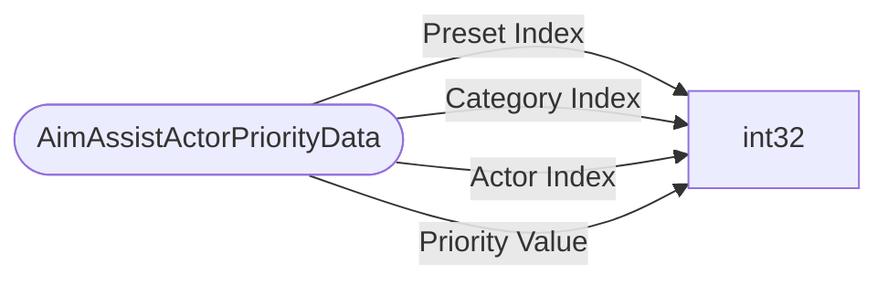

# AimAssistActorPriorityData

`struct`

```mermaid
flowchart LR
  ROOT(["AimAssistActorPriorityData"])
  ROOT -->|"Preset Index"| int32["int32"]
  ROOT -->|"Category Index"| int32["int32"]
  ROOT -->|"Actor Index"| int32["int32"]
  ROOT -->|"Priority Value"| int32["int32"]
```

