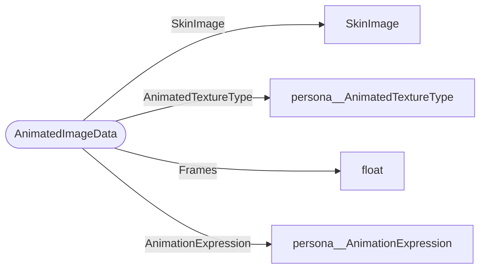

# AnimatedImageData

`struct`

```mermaid
flowchart LR
  ROOT(["AnimatedImageData"])
  ROOT -->|"SkinImage"| SkinImage["SkinImage"]
  ROOT -->|"AnimatedTextureType"| persona__AnimatedTextureType["persona__AnimatedTextureType"]
  ROOT -->|"Frames"| float["float"]
  ROOT -->|"AnimationExpression"| persona__AnimationExpression["persona__AnimationExpression"]
```

