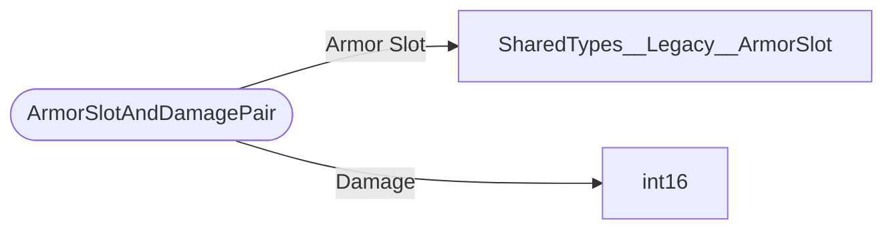

# ArmorSlotAndDamagePair

`struct`

```mermaid
flowchart LR
  ROOT(["ArmorSlotAndDamagePair"])
  ROOT -->|"Armor Slot"| SharedTypes__Legacy__ArmorSlot["SharedTypes__Legacy__ArmorSlot"]
  ROOT -->|"Damage"| int16["int16"]
```

