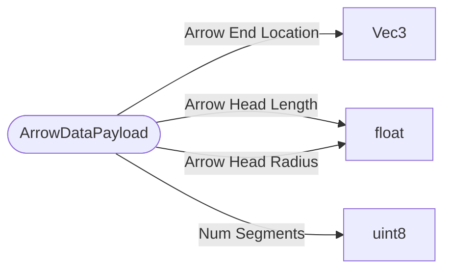

# ArrowDataPayload

`struct`

```mermaid
flowchart LR
  ROOT(["ArrowDataPayload"])
  ROOT -->|"Arrow End Location"| Vec3["Vec3"]
  ROOT -->|"Arrow Head Length"| float["float"]
  ROOT -->|"Arrow Head Radius"| float["float"]
  ROOT -->|"Num Segments"| uint8["uint8"]
```

