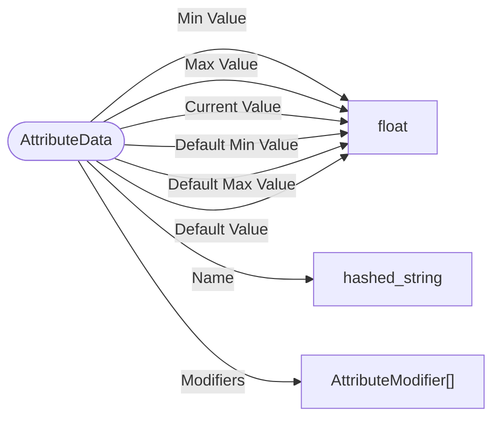

# AttributeData

`struct`

```mermaid
flowchart LR
  ROOT(["AttributeData"])
  ROOT -->|"Min Value"| float["float"]
  ROOT -->|"Max Value"| float["float"]
  ROOT -->|"Current Value"| float["float"]
  ROOT -->|"Default Min Value"| float["float"]
  ROOT -->|"Default Max Value"| float["float"]
  ROOT -->|"Default Value"| float["float"]
  ROOT -->|"Name"| hashed_string["hashed_string"]
  ROOT -->|"Modifiers"| AttributeModifier["AttributeModifier[]"]
```

