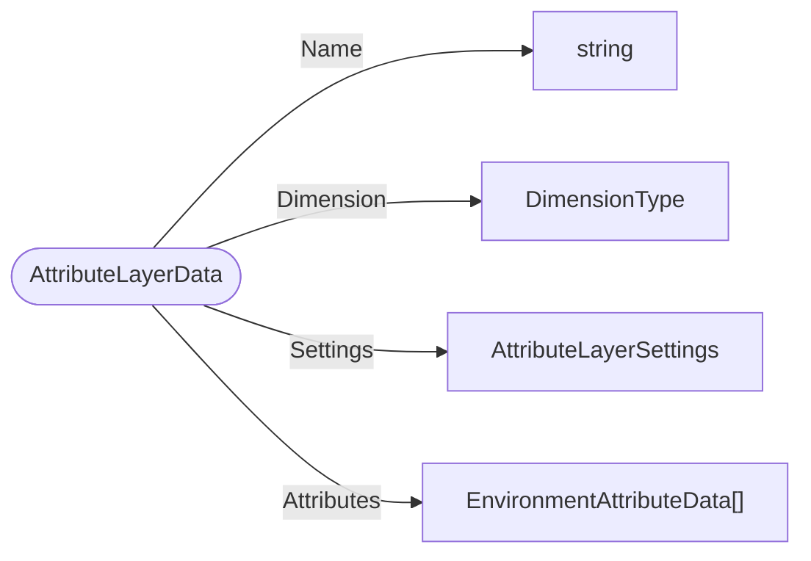

# AttributeLayerData

`struct`

```mermaid
flowchart LR
  ROOT(["AttributeLayerData"])
  ROOT -->|"Name"| string["string"]
  ROOT -->|"Dimension"| DimensionType["DimensionType"]
  ROOT -->|"Settings"| AttributeLayerSettings["AttributeLayerSettings"]
  ROOT -->|"Attributes"| EnvironmentAttributeData["EnvironmentAttributeData[]"]
```

