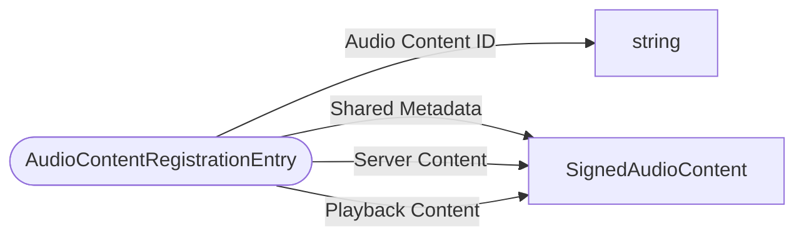

# AudioContentRegistrationEntry

`struct`

```mermaid
flowchart LR
  ROOT(["AudioContentRegistrationEntry"])
  ROOT -->|"Audio Content ID"| string["string"]
  ROOT -->|"Shared Metadata"| SignedAudioContent["SignedAudioContent"]
  ROOT -->|"Server Content"| SignedAudioContent["SignedAudioContent"]
  ROOT -->|"Playback Content"| SignedAudioContent["SignedAudioContent"]
```

