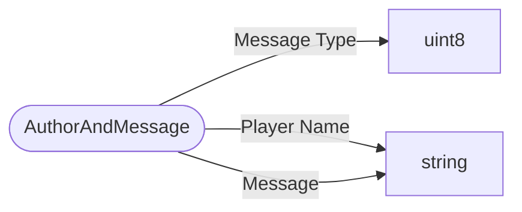

# AuthorAndMessage

`struct`

```mermaid
flowchart LR
  ROOT(["AuthorAndMessage"])
  ROOT -->|"Message Type"| uint8["uint8"]
  ROOT -->|"Player Name"| string["string"]
  ROOT -->|"Message"| string["string"]
```

