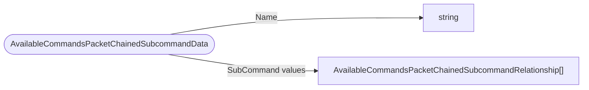

# AvailableCommandsPacketChainedSubcommandData

`struct`

```mermaid
flowchart LR
  ROOT(["AvailableCommandsPacketChainedSubcommandData"])
  ROOT -->|"Name"| string["string"]
  ROOT -->|"SubCommand values"| AvailableCommandsPacketChainedSubcommandRelationship["AvailableCommandsPacketChainedSubcommandRelationship[]"]
```

