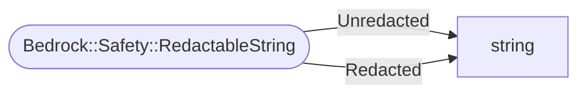

# Bedrock::Safety::RedactableString

`struct`

- protocol: 2168
- minecraft: 1.26.40

```mermaid
flowchart LR
  ROOT(["Bedrock::Safety::RedactableString"])
  ROOT -->|"Unredacted"| string["string"]
  ROOT -->|"Redacted"| string["string"]
```

