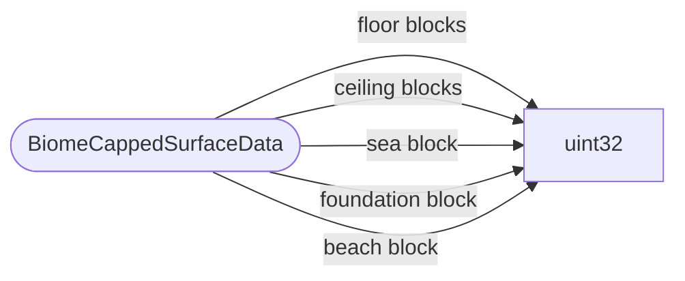

# BiomeCappedSurfaceData

`struct`

```mermaid
flowchart LR
  ROOT(["BiomeCappedSurfaceData"])
  ROOT -->|"floor blocks"| uint32["uint32[]"]
  ROOT -->|"ceiling blocks"| uint32["uint32[]"]
  ROOT -->|"sea block"| uint32["uint32"]
  ROOT -->|"foundation block"| uint32["uint32"]
  ROOT -->|"beach block"| uint32["uint32"]
```

