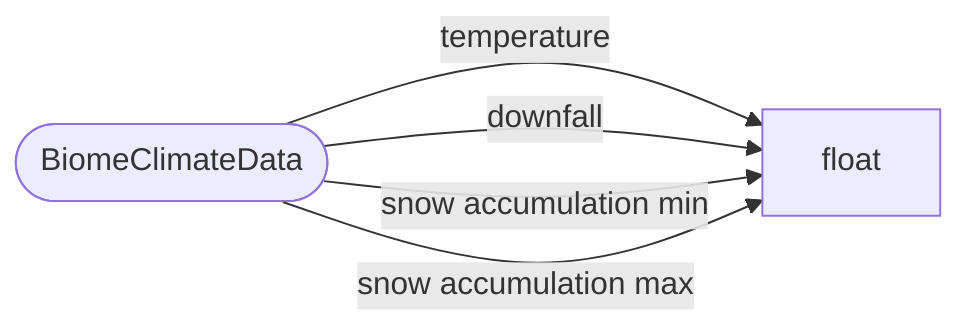

# BiomeClimateData

`struct`

```mermaid
flowchart LR
  ROOT(["BiomeClimateData"])
  ROOT -->|"temperature"| float["float"]
  ROOT -->|"downfall"| float["float"]
  ROOT -->|"snow accumulation min"| float["float"]
  ROOT -->|"snow accumulation max"| float["float"]
```

