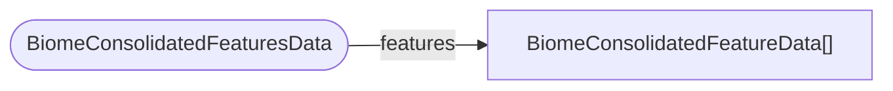

# BiomeConsolidatedFeaturesData

`struct`

```mermaid
flowchart LR
  ROOT(["BiomeConsolidatedFeaturesData"])
  ROOT -->|"features"| BiomeConsolidatedFeatureData["BiomeConsolidatedFeatureData[]"]
```

