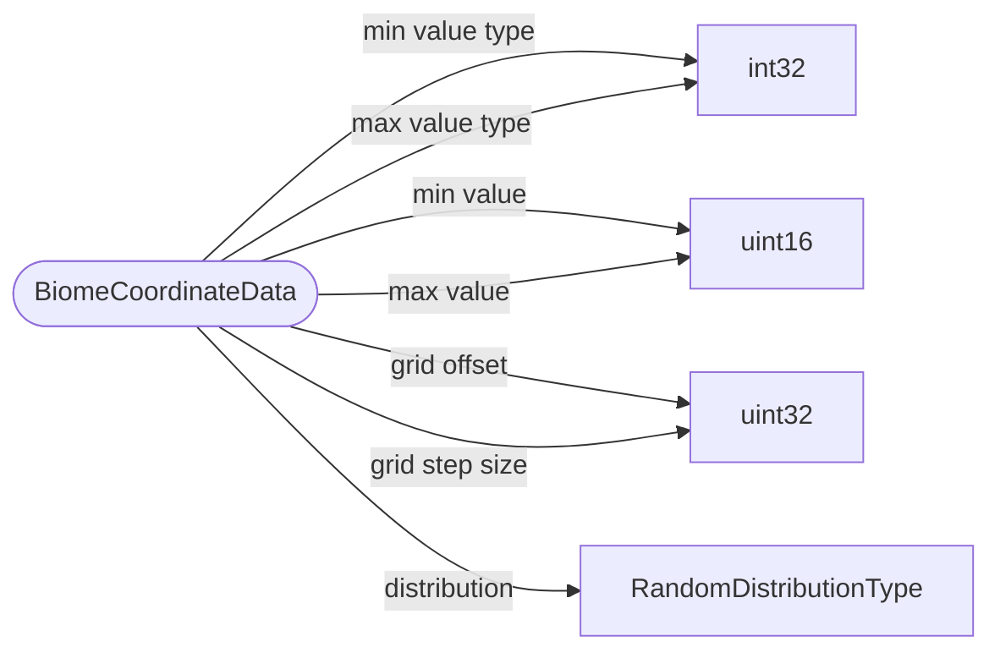

# BiomeCoordinateData

`struct`

```mermaid
flowchart LR
  ROOT(["BiomeCoordinateData"])
  ROOT -->|"min value type"| int32["int32"]
  ROOT -->|"min value"| uint16["uint16"]
  ROOT -->|"max value type"| int32["int32"]
  ROOT -->|"max value"| uint16["uint16"]
  ROOT -->|"grid offset"| uint32["uint32"]
  ROOT -->|"grid step size"| uint32["uint32"]
  ROOT -->|"distribution"| RandomDistributionType["RandomDistributionType"]
```

