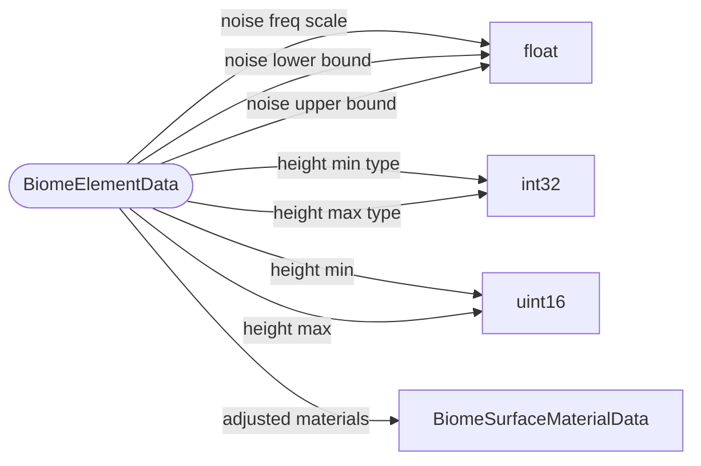

# BiomeElementData

`struct`

```mermaid
flowchart LR
  ROOT(["BiomeElementData"])
  ROOT -->|"noise freq scale"| float["float"]
  ROOT -->|"noise lower bound"| float["float"]
  ROOT -->|"noise upper bound"| float["float"]
  ROOT -->|"height min type"| int32["int32"]
  ROOT -->|"height min"| uint16["uint16"]
  ROOT -->|"height max type"| int32["int32"]
  ROOT -->|"height max"| uint16["uint16"]
  ROOT -->|"adjusted materials"| BiomeSurfaceMaterialData["BiomeSurfaceMaterialData"]
```

