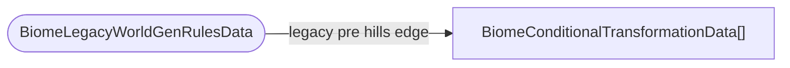

# BiomeLegacyWorldGenRulesData

`struct`

```mermaid
flowchart LR
  ROOT(["BiomeLegacyWorldGenRulesData"])
  ROOT -->|"legacy pre hills edge"| BiomeConditionalTransformationData["BiomeConditionalTransformationData[]"]
```

