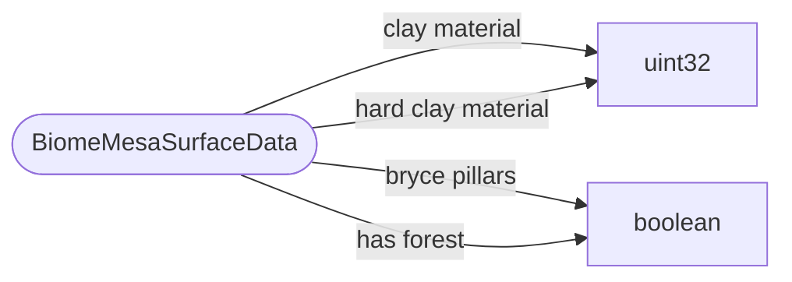

# BiomeMesaSurfaceData

`struct`

```mermaid
flowchart LR
  ROOT(["BiomeMesaSurfaceData"])
  ROOT -->|"clay material"| uint32["uint32"]
  ROOT -->|"hard clay material"| uint32["uint32"]
  ROOT -->|"bryce pillars"| boolean["boolean"]
  ROOT -->|"has forest"| boolean["boolean"]
```

