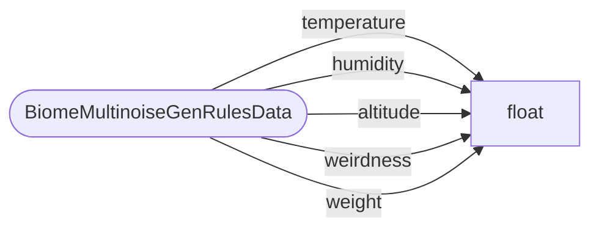

# BiomeMultinoiseGenRulesData

`struct`

```mermaid
flowchart LR
  ROOT(["BiomeMultinoiseGenRulesData"])
  ROOT -->|"temperature"| float["float"]
  ROOT -->|"humidity"| float["float"]
  ROOT -->|"altitude"| float["float"]
  ROOT -->|"weirdness"| float["float"]
  ROOT -->|"weight"| float["float"]
```

