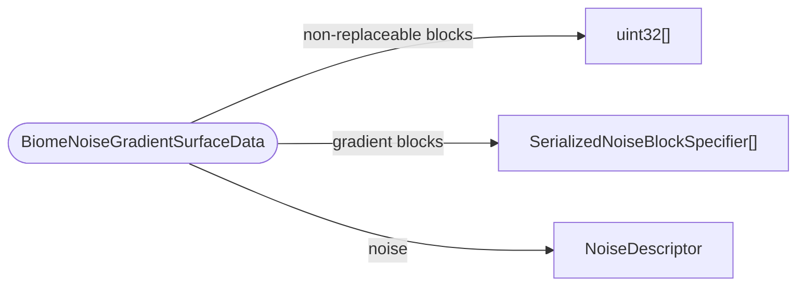

# BiomeNoiseGradientSurfaceData

`struct`

```mermaid
flowchart LR
  ROOT(["BiomeNoiseGradientSurfaceData"])
  ROOT -->|"non-replaceable blocks"| uint32["uint32[]"]
  ROOT -->|"gradient blocks"| SerializedNoiseBlockSpecifier["SerializedNoiseBlockSpecifier[]"]
  ROOT -->|"noise"| NoiseDescriptor["NoiseDescriptor"]
```

