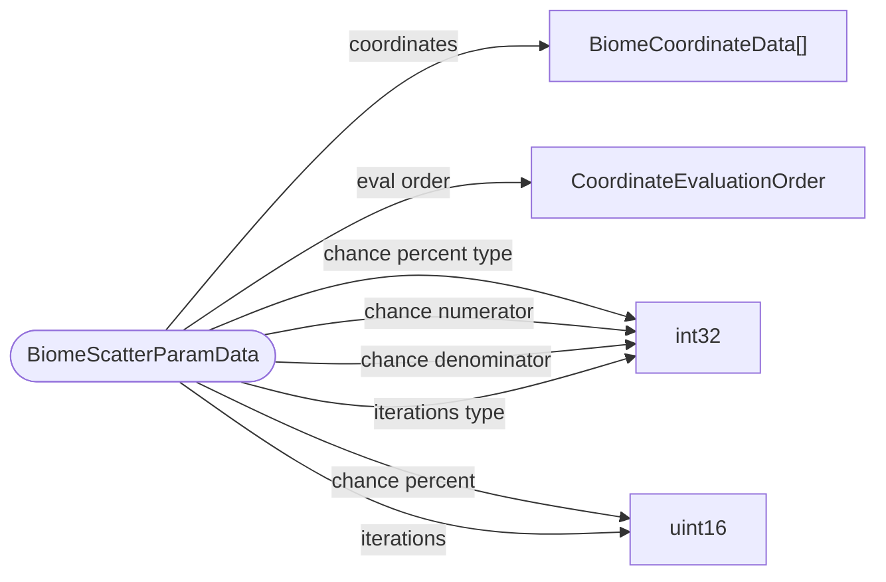

# BiomeScatterParamData

`struct`

```mermaid
flowchart LR
  ROOT(["BiomeScatterParamData"])
  ROOT -->|"coordinates"| BiomeCoordinateData["BiomeCoordinateData[]"]
  ROOT -->|"eval order"| CoordinateEvaluationOrder["CoordinateEvaluationOrder"]
  ROOT -->|"chance percent type"| int32["int32"]
  ROOT -->|"chance percent"| uint16["uint16"]
  ROOT -->|"chance numerator"| int32["int32"]
  ROOT -->|"chance denominator"| int32["int32"]
  ROOT -->|"iterations type"| int32["int32"]
  ROOT -->|"iterations"| uint16["uint16"]
```

