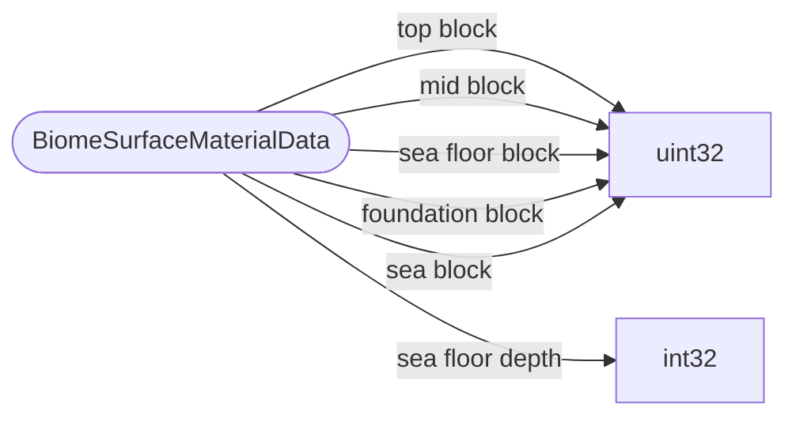

# BiomeSurfaceMaterialData

`struct`

```mermaid
flowchart LR
  ROOT(["BiomeSurfaceMaterialData"])
  ROOT -->|"top block"| uint32["uint32"]
  ROOT -->|"mid block"| uint32["uint32"]
  ROOT -->|"sea floor block"| uint32["uint32"]
  ROOT -->|"foundation block"| uint32["uint32"]
  ROOT -->|"sea block"| uint32["uint32"]
  ROOT -->|"sea floor depth"| int32["int32"]
```

