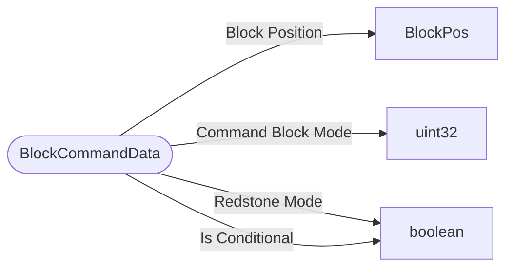

# BlockCommandData

`struct`

```mermaid
flowchart LR
  ROOT(["BlockCommandData"])
  ROOT -->|"Block Position"| BlockPos["BlockPos"]
  ROOT -->|"Command Block Mode"| uint32["uint32"]
  ROOT -->|"Redstone Mode"| boolean["boolean"]
  ROOT -->|"Is Conditional"| boolean["boolean"]
```

