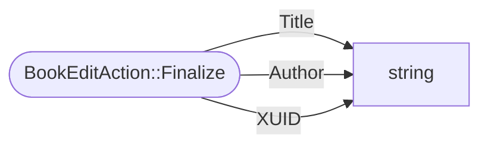

# BookEditAction::Finalize

`struct`

```mermaid
flowchart LR
  ROOT(["BookEditAction::Finalize"])
  ROOT -->|"Title"| string["string"]
  ROOT -->|"Author"| string["string"]
  ROOT -->|"XUID"| string["string"]
```

