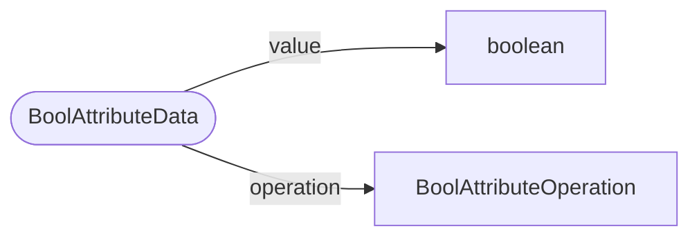

# BoolAttributeData

`struct`

```mermaid
flowchart LR
  ROOT(["BoolAttributeData"])
  ROOT -->|"value"| boolean["boolean"]
  ROOT -->|"operation"| BoolAttributeOperation["BoolAttributeOperation"]
```

